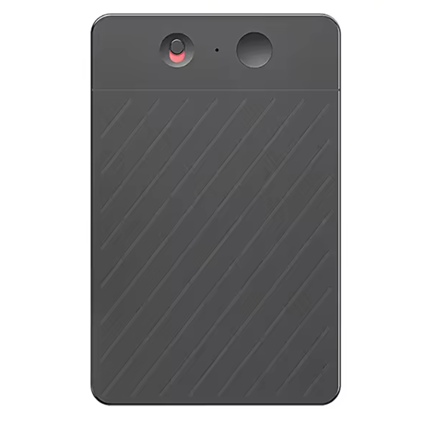

# airec

<p align="center">
  
</p>

This project is for the AIREC voice recorder, the small card-sized Bluetooth
recorder in the picture above. It is an unofficial, open-source alternative to
the manufacturer's phone app.

Control an AIREC voice recorder from your computer over Bluetooth. List your
recordings, download them as playable audio files, start and stop recording,
and set the recorder's clock. You do not need an account, the phone app or an
internet connection.

`airec` is two things:

- A command-line tool, for people who want to use their recorder.
- A Python library, for people who want to write software for the recorder.
  See the [library guide](docs/library.md).

**Status: experimental.** This was tested on one recorder, on Linux, on
2026-10-02. Other recorder models, firmware versions, macOS and Windows were
not tested. They may work, but nobody has checked yet.

## What it can do

| Task | Supported |
| --- | --- |
| Find nearby recorders | Yes |
| Show battery level and storage space | Yes |
| List recordings with date, time and size | Yes |
| Download recordings as Ogg Opus audio (or raw) | Yes |
| Start, pause, resume and stop recording | Yes |
| Delete one recording | Yes |
| Read and set the recorder's clock | Yes |
| Wi-Fi transfer, resuming downloads, live audio | No |
| Firmware updates, reset, format, erase all | No, on purpose |

For the full list, see [limitations](docs/limitations.md).

## Install

You need Python 3.12 or newer and a computer with Bluetooth.

```bash
git clone <this repository>
cd <repository directory>
python3 -m venv .venv
.venv/bin/python -m pip install -e .
```

The command is now `.venv/bin/airec`. If you activate the environment
(`source .venv/bin/activate`), you can type `airec` instead. The examples
below use `airec`.

## Before you connect

1. Turn on the recorder and keep it near the computer.
2. Disconnect the phone app. The recorder accepts only one connection at a
   time. If the app reconnects by itself, turn off Bluetooth on the phone.
3. Make sure Bluetooth is on for your computer.

**Turning the recorder on can start a recording.** Run `airec status` to check.

## Find your recorder

```bash
airec scan
```

This lists every nearby device whose name starts with `AIREC`, with its
address and signal strength:

```
AIREC 1234  AA:BB:CC:DD:EE:FF  -42 dBm
```

If you have only one recorder nearby, you can skip this step. Every command
finds the recorder by itself when exactly one is in range.

If more than one recorder is nearby, choose one by address. Use `--address`
for one command, or set `AIREC_ADDRESS` to use it for all commands:

```bash
airec --address AA:BB:CC:DD:EE:FF list
export AIREC_ADDRESS=AA:BB:CC:DD:EE:FF
```

On macOS, the address is a long device ID, not a `AA:BB:...` value.

Some devices change their Bluetooth address from time to time. If a saved
address stops working, run `airec scan` again.

## Common tasks

### See your recordings

```bash
airec list
```

This shows the battery level and a table of recordings:

```
Battery: 87%
ID              Recorded at          Size
20260101120000  2026-01-01 12:00:00  2.0 MB
```

Each recording has a 14-digit ID. The ID is the date and time when the
recording started. Use it with `download` and `delete`. Running `airec` with
no command does the same as `airec list`.

### Download a recording

```bash
airec download 20260101120000
```

This saves `recordings/20260101120000.opus`. Players such as VLC can play
Ogg Opus files.

- Choose another file name with `--output my-meeting.opus`.
- Keep the recorder's original bytes with `--format raw`.
- Long recordings take longer to download. If a download stops with a timeout,
  allow more time with `--download-timeout 300` (in seconds; the default is 120).

Downloading never deletes the recording from the recorder. It never replaces
a file that already exists on your computer.

You cannot download while the recorder is recording or paused. To stop the
current recording and then download, add `--stop-recording`. The recorder does
not start recording again after the download.

### Record

```bash
airec status    # recording, paused or stopped
airec start
airec pause
airec resume
airec stop
```

Each command makes a new connection. Connecting and disconnecting can affect a
paused recording. For many pause and resume steps in a row, use the
[library](docs/library.md) with one connection.

The recorder can discard very short recordings by itself, even after `stop`
reports success.

### Delete a recording

```bash
airec delete 20260101120000 --yes
```

Deletion is permanent. The recorder must be stopped. `airec` deletes only the
recording with that exact ID, and then checks that it is gone. Without `--yes`,
nothing is deleted. Files you downloaded to your computer are not affected.

### Check storage

```bash
airec storage
```

This shows total, free and used space, in MB as the recorder reports them.

### Set the clock

```bash
airec clock                                  # show the recorder's time
airec set-clock                              # use the computer's time
airec set-clock --time 2026-10-02T12:30:00   # use a specific local time
```

The recorder must be stopped. The clock has no time zone. New recordings get
their ID from this clock. Existing recordings keep their IDs.

## Options for all commands

You can put these options before or after the command name.

| Option | Meaning |
| --- | --- |
| `--address ADDRESS` | Use this recorder. Otherwise `airec` uses `AIREC_ADDRESS`, or finds the one recorder in range. |
| `--timeout SECONDS` | How long to wait for the recorder to reply. The default is 10. |
| `--json` | Print JSON for scripts, instead of text. |

Run `airec --help` or `airec COMMAND --help` for all options.

When a command fails, `airec` prints the reason and exits with a nonzero code.

## When something goes wrong

**A command timed out.** A timeout does not mean the command did nothing. The
recorder may have done it and failed to reply. Run `airec status` or
`airec list` to see the current state before you try again.

**"no AIREC recorder found".** Make sure the recorder is on, near the computer
and not connected to the phone. Then run `airec scan`. If `scan` shows nothing,
restart the recorder. Restarting can start a recording, so check `airec status`
after.

**"multiple AIREC recorders found".** Choose one with `--address` or
`AIREC_ADDRESS`. The error message lists the addresses.

**"selected recorder is not advertising".** The recorder is off, out of range,
connected to another device, or its address has changed. Run `airec scan`.

**The recorder says it is recording or paused.** Download, delete and
set-clock need a stopped recorder. Run `airec stop` only if you want to end the
current recording.

**The audio file does not play.** Download it again with `--format raw` and
keep the raw file. Your recorder may use an audio format that was not tested.

For more help, see [limitations](docs/limitations.md).

## Privacy

`airec` talks only to your recorder. It sends nothing to the internet.
Recordings stay on your computer. The `recordings/` folder in this repository
is ignored by Git, so you cannot commit it by accident.

## For developers

- [Library guide](docs/library.md): the Python API.
- [Research](docs/research/): the Bluetooth protocol, how it was found, test
  results and technical limits.

Run the offline tests, which do not need a recorder:

```bash
.venv/bin/python -m unittest discover -s tests -v
```

## License

[GNU Affero General Public License v3](LICENSE).
